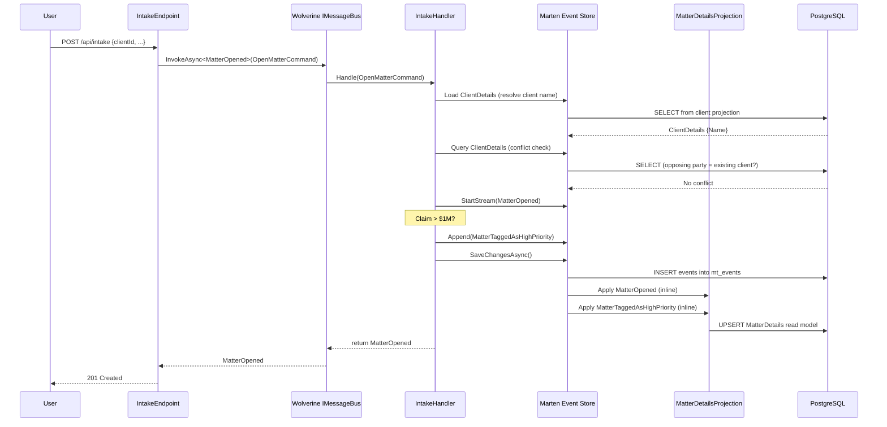
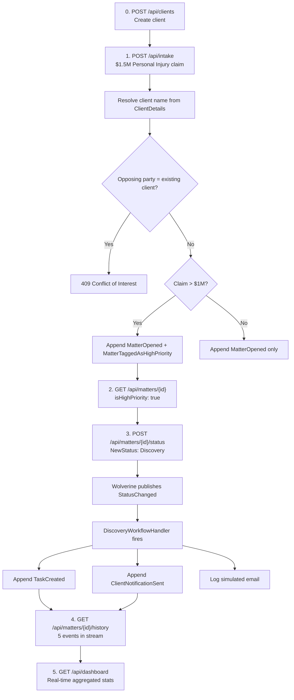

# Apex Legal - Case Management System

A legal case management system built with the **Critter Stack** (Marten + Wolverine), **.NET Aspire**, and **Event Sourcing**. Designed as an interview showcase demonstrating modern .NET architectural patterns.

## Table of Contents

- [Architecture Overview](#architecture-overview)
- [How the Pieces Fit Together](#how-the-pieces-fit-together)
- [Event Sourcing with Marten](#event-sourcing-with-marten)
  - [What is Event Sourcing?](#what-is-event-sourcing)
  - [Events as Immutable Records](#events-as-immutable-records)
  - [The Matter Aggregate](#the-matter-aggregate)
  - [The Client Aggregate](#the-client-aggregate)
  - [Projections: Building Read Models from Events](#projections-building-read-models-from-events)
- [Messaging and Workflows with Wolverine](#messaging-and-workflows-with-wolverine)
  - [Commands and Handlers](#commands-and-handlers)
  - [Event-Driven Workflows](#event-driven-workflows)
  - [AutoApplyTransactions](#autoapplytransactions)
- [Vertical Slice Architecture](#vertical-slice-architecture)
- [.NET Aspire Orchestration](#net-aspire-orchestration)
- [API Reference](#api-reference)
- [The Demo Flow](#the-demo-flow)
- [Project Structure](#project-structure)
- [Getting Started](#getting-started)

---

## Architecture Overview


The system is split into four projects:

| Project | Role |
|---------|------|
| **ApexLegal.AppHost** | Aspire orchestrator. Defines the topology: Postgres, API, Web. |
| **ApexLegal.Api** | The core. Event sourcing, Wolverine handlers, Minimal API endpoints. |
| **ApexLegal.Web** | Razor Pages frontend. Calls the API over HTTP via Aspire service discovery. |
| **ApexLegal.ServiceDefaults** | Shared Aspire config: OpenTelemetry, health checks, service discovery, resilience. |

---

## How the Pieces Fit Together

This diagram shows what happens when a user creates a new legal matter with a $1.5M claim:



The key insight: **the write side appends immutable events**, and **projections transform those events into queryable read models**. The endpoint never writes to a "matters" table directly.

---

## Event Sourcing with Marten

### What is Event Sourcing?

In traditional CRUD, you overwrite rows in a database. The current state is all you have. If someone changed a case status last Tuesday, that history is gone.

In Event Sourcing, **every state change is stored as an immutable event**. The current state is derived by replaying events in order. You get a complete audit trail for free.

```mermaid
graph LR
    subgraph "Traditional CRUD"
        T1[UPDATE matters SET status = 'Discovery']
        T2["Row: {status: 'Discovery'}"]
        T1 --> T2
    end

    subgraph "Event Sourcing"
        E1["MatterOpened {claim: $1.5M}"]
        E2["MatterTaggedAsHighPriority {}"]
        E3["StatusChanged {New → Discovery}"]
        E4["TaskCreated {evidence request}"]
        E1 --> E2 --> E3 --> E4
    end
```



With Event Sourcing you can answer questions like "What was the state of this matter on January 15th?" by replaying events up to that date. In the legal domain, this audit trail isn't optional -- it's a requirement.

### Events as Immutable Records

Every event in the system is a C# `record` -- immutable by design, named in past tense to reflect that something **already happened**:

```csharp
// Domain/Events/MatterEvents.cs

public record MatterOpened(
    Guid MatterId,
    Guid ClientId,
    string ClientName,          // Denormalized for self-contained events
    string OpposingParty,
    CaseType CaseType,
    decimal InitialClaimAmount,
    DateTime OccurredAt
);

public record StatusChanged(
    Guid MatterId,
    MatterStatus OldStatus,
    MatterStatus NewStatus,
    string Reason,
    DateTime OccurredAt
);

// Domain/Events/ClientEvents.cs

public record ClientCreated(
    Guid ClientId,
    string Name,
    DateTime OccurredAt
);
```

**Naming convention**: Events are always past tense (`MatterOpened`, not `OpenMatter`). Commands are imperative (`OpenMatterCommand`). This distinction matters -- events describe facts, commands describe intentions.

The full event catalog:

| Event | Aggregate | When It Happens |
|-------|-----------|----------------|
| `ClientCreated` | Client | New client added to the system |
| `MatterOpened` | Matter | New case intake submitted |
| `MatterTaggedAsHighPriority` | Matter | Claim amount exceeds $1M |
| `AttorneyAssigned` | Matter | Attorney assigned to matter |
| `StatusChanged` | Matter | Matter transitions between statuses |
| `TaskCreated` | Matter | Workflow auto-creates a task |
| `ClientNotificationSent` | Matter | System sends (simulated) notification |
| `NoteAdded` | Matter | Note added to matter |
| `SettlementOfferReceived` | Matter | Settlement offer recorded |

### The Matter Aggregate

An **aggregate** is the consistency boundary in Event Sourcing. The `Matter` class doesn't have setters you call directly -- it has `Apply()` methods that Marten calls during event replay to rebuild state:

```csharp
// Domain/Matter.cs

public class Matter
{
    public Guid Id { get; private set; }
    public Guid ClientId { get; private set; }
    public string ClientName { get; private set; } = default!;
    public string OpposingParty { get; private set; } = default!;
    public MatterStatus Status { get; private set; }
    public bool IsHighPriority { get; private set; }

    public Matter() { }  // Marten needs this for rehydration

    public void Apply(MatterOpened @event)
    {
        Id = @event.MatterId;
        ClientId = @event.ClientId;
        ClientName = @event.ClientName;
        Status = MatterStatus.New;
        CurrentClaimAmount = @event.InitialClaimAmount;
    }

    public void Apply(MatterTaggedAsHighPriority @event)
    {
        IsHighPriority = true;
    }

    public void Apply(StatusChanged @event)
    {
        Status = @event.NewStatus;
    }
}
```

**How Marten uses this**: When you call `session.Events.AggregateStreamAsync<Matter>(matterId)`, Marten loads all events for that stream from PostgreSQL and calls the matching `Apply()` methods in order. The result is the current state of the matter, reconstructed from history.

You never call `matter.Status = MatterStatus.Discovery` directly. Instead, you append a `StatusChanged` event, and the aggregate rebuilds itself.

### The Client Aggregate

The `Client` aggregate follows the same pattern. Clients are managed independently and referenced by `ClientId` from matters:

```csharp
// Domain/Client.cs

public class Client
{
    public Guid Id { get; private set; }
    public string Name { get; private set; } = default!;

    public Client() { }

    public void Apply(ClientCreated @event)
    {
        Id = @event.ClientId;
        Name = @event.Name;
    }
}
```

**Design decision**: `MatterOpened` stores both `ClientId` (foreign key) and `ClientName` (denormalized string). Events are immutable facts -- they must be self-contained. If a client name were to change, historical events would still reflect the name at the time of matter creation.

### Projections: Building Read Models from Events

Replaying the full event stream every time you need to read data would be slow. **Projections** solve this by maintaining pre-computed read models that update as events arrive.

Marten supports two projection lifecycles:


#### SingleStreamProjection: MatterDetails

This projection maintains one read model per matter. It's **Inline** -- updated in the same database transaction as the event append, so queries always return the latest state.

```csharp
// Features/MatterManagement/MatterDetailsProjection.cs

public record MatterDetails(
    Guid Id, Guid ClientId, string ClientName,
    string OpposingParty, MatterStatus Status,
    bool IsHighPriority, decimal CurrentClaimAmount,
    Guid? AssignedAttorneyId, DateTime CreatedAt
);

public class MatterDetailsProjection : SingleStreamProjection<MatterDetails, Guid>
{
    public MatterDetails Create(MatterOpened @event)
    {
        return new MatterDetails(
            @event.MatterId, @event.ClientId, @event.ClientName,
            @event.OpposingParty, MatterStatus.New, false,
            @event.InitialClaimAmount, null, @event.OccurredAt
        );
    }

    public MatterDetails Apply(MatterTaggedAsHighPriority @event, MatterDetails current)
    {
        return current with { IsHighPriority = true };
    }

    public MatterDetails Apply(StatusChanged @event, MatterDetails current)
    {
        return current with { Status = @event.NewStatus };
    }
}
```

**Why Inline?** The status change endpoint reads `MatterDetails` to get the current status before appending a `StatusChanged` event. If this projection were async, you might read stale data and record an incorrect `OldStatus`.

#### SingleStreamProjection: ClientDetails

The client projection is also **Inline** because the Intake handler must resolve the client name immediately when creating a matter:

```csharp
// Features/ClientManagement/ClientDetailsProjection.cs

public record ClientDetails(Guid Id, string Name, DateTime CreatedAt);

public class ClientDetailsProjection : SingleStreamProjection<ClientDetails, Guid>
{
    public ClientDetails Create(ClientCreated @event) =>
        new ClientDetails(@event.ClientId, @event.Name, @event.OccurredAt);
}
```

**Why Inline?** The Intake handler calls `session.LoadAsync<ClientDetails>(clientId)` to resolve the client name and `session.Query<ClientDetails>()` for the conflict-of-interest check. Both require immediate consistency.

#### MultiStreamProjection: DashboardStatistics

This projection aggregates data from **all** matter streams into a single dashboard document. It's **Async** -- processed in the background by Marten's async daemon.

```csharp
// Features/Dashboard/DashboardStatisticsProjection.cs

public class DashboardStatisticsProjection : MultiStreamProjection<DashboardStatisticsView, Guid>
{
    public static readonly Guid DashboardId = Guid.Parse("018da675-...");

    public DashboardStatisticsProjection()
    {
        // Route all events to the same single dashboard document
        Identity<MatterOpened>(_ => DashboardId);
        Identity<MatterTaggedAsHighPriority>(_ => DashboardId);
        Identity<StatusChanged>(_ => DashboardId);
    }

    public void Apply(MatterOpened @event, DashboardStatisticsView view)
    {
        view.TotalActiveCases++;
        view.TotalPotentialSettlementValue += @event.InitialClaimAmount;
    }

    public void Apply(StatusChanged @event, DashboardStatisticsView view)
    {
        if (@event.NewStatus == MatterStatus.Closed)
            view.TotalActiveCases--;
    }
}
```

**Why Async?** Dashboard stats tolerate brief staleness (sub-second). Keeping this async means every `POST /api/intake` doesn't need to also update the dashboard in the same transaction.

**Why not `COUNT(*)`?** The dashboard never runs `SELECT COUNT(*) FROM matters`. Instead, the projection _incrementally_ updates counters as events arrive. This is O(1) per event, not O(n) per query.

The async daemon is enabled in configuration:

```csharp
.AddAsyncDaemon(DaemonMode.Solo)  // Single-node background processor
```

---

## Messaging and Workflows with Wolverine

### Commands and Handlers

**Wolverine** is an in-process messaging framework. You send a command, Wolverine discovers and invokes the matching handler. No marker interfaces, no manual registration -- pure convention.

The convention: a class with a `Handle` method whose first parameter matches the message type.


The endpoint sends a command through Wolverine's `IMessageBus`:

```csharp
// Features/Intake/IntakeEndpoint.cs

app.MapPost("/api/intake", async (IntakeRequest request, IMessageBus bus, CancellationToken ct) =>
{
    var command = new OpenMatterCommand(
        request.ClientId, request.OpposingParty,
        request.CaseType, request.InitialClaimAmount
    );

    var result = await bus.InvokeAsync<MatterOpened>(command, ct);

    return Results.Created($"/api/matters/{result.MatterId}", result);
});
```

Wolverine finds `IntakeHandler` because it has a `Handle` method that takes `OpenMatterCommand`:

```csharp
// Features/Intake/IntakeHandler.cs

public class IntakeHandler
{
    public async Task<MatterOpened> Handle(
        OpenMatterCommand command,
        IDocumentSession session,
        IMessageContext bus,
        CancellationToken ct)
    {
        // Resolve client name from inline projection
        var client = await session.LoadAsync<ClientDetails>(command.ClientId, ct);

        // Conflict check: opposing party cannot be an existing client
        var conflictExists = await session.Query<ClientDetails>()
            .AnyAsync(c => c.Name == command.OpposingParty, ct);

        // Create event with both ClientId and denormalized name
        session.Events.StartStream<Matter>(matterId,
            new MatterOpened(matterId, command.ClientId, client.Name, ...));

        await session.SaveChangesAsync(ct);
        return @event;
    }
}
```

**Key detail**: Wolverine injects dependencies (`IDocumentSession`, `IMessageContext`) directly into handler method parameters. No constructor injection needed (though it works too, as shown in `DiscoveryWorkflowHandler`).

### Event-Driven Workflows

When a matter transitions to "Discovery", the system should automatically create a task and send a notification. This is implemented as a Wolverine handler that reacts to `StatusChanged` events:


The handler:

```csharp
// Features/Workflows/DiscoveryWorkflowHandler.cs

public class DiscoveryWorkflowHandler
{
    private readonly ILogger<DiscoveryWorkflowHandler> _logger;

    public DiscoveryWorkflowHandler(ILogger<DiscoveryWorkflowHandler> logger)
    {
        _logger = logger;
    }

    public void Handle(StatusChanged @event, IDocumentSession session)
    {
        if (@event.NewStatus != MatterStatus.Discovery) return;

        // Auto-create task
        var taskEvent = new TaskCreated(
            @event.MatterId,
            "Request Evidence task for assigned attorney",
            "Assigned Attorney",
            DateTime.UtcNow.AddDays(7),
            DateTime.UtcNow
        );
        session.Events.Append(@event.MatterId, taskEvent);

        // Simulated email notification
        var notificationEvent = new ClientNotificationSent(
            @event.MatterId, "Discovery Started Email", DateTime.UtcNow
        );
        session.Events.Append(@event.MatterId, notificationEvent);

        _logger.LogInformation("[SIMULATED EMAIL] ...");
    }
}
```

**Two dispatch patterns used in this project:**

| Pattern | Method | Behavior |
|---------|--------|----------|
| Request/Response | `bus.InvokeAsync<T>(command)` | Send command, wait for handler to return `T`. Used for intake. |
| Fire-and-Forget | `bus.PublishAsync(event)` | Publish event, don't wait. Used for workflow triggers. |

### AutoApplyTransactions

Wolverine's `AutoApplyTransactions` policy (configured in `WolverineConfiguration.cs`) wraps every handler in a Marten transaction automatically. The `DiscoveryWorkflowHandler` appends events to the session but never calls `SaveChangesAsync()` -- Wolverine handles that after the handler completes.

```csharp
// Infrastructure/WolverineConfiguration.cs

options.Policies.AutoApplyTransactions();  // Wolverine commits the session after handler
```

This pairs with `.IntegrateWithWolverine()` on the Marten side, which gives Wolverine control over Marten's session lifecycle and enables the transactional outbox pattern.

---

## Vertical Slice Architecture

Code is organized by **business capability**, not technical layer:

```
ApexLegal.Api/
  Features/
    Intake/                         # Everything for case intake
      IntakeEndpoint.cs             #   Route definition
      IntakeHandler.cs              #   Wolverine handler + command
    ClientManagement/               # Everything for client CRUD
      ClientManagementEndpoints.cs  #   POST/GET /api/clients
      ClientDetailsProjection.cs    #   Inline projection
    MatterManagement/               # Everything for matter CRUD
      MatterManagementEndpoints.cs  #   GET matters, GET history, POST status
      MatterDetailsProjection.cs    #   Inline projection
    Dashboard/                      # Everything for dashboard
      DashboardEndpoints.cs         #   GET /api/dashboard
      DashboardStatisticsProjection.cs  # Async projection
    Workflows/                      # Automated workflows
      DiscoveryWorkflowHandler.cs   #   React to status changes
  Domain/                           # Shared domain model
    Client.cs                       #   Client aggregate root
    Matter.cs                       #   Matter aggregate root
    Events/
      ClientEvents.cs               #   Client domain events
      MatterEvents.cs               #   Matter domain events
  Infrastructure/                   # Cross-cutting only
    MartenConfiguration.cs          #   Marten setup
    WolverineConfiguration.cs       #   Wolverine setup
    EndpointDiscovery.cs            #   Maps all endpoints
```

**The rule**: each feature folder contains everything needed for that slice. You could delete `Features/Dashboard/` and nothing else would break.

**Program.cs is minimal** (under 30 lines). All configuration lives in extension methods in `Infrastructure/`:

```csharp
var builder = WebApplication.CreateBuilder(args);
builder.AddServiceDefaults();
builder.AddMartenWithEventSourcing();   // Infrastructure/MartenConfiguration.cs
builder.AddWolverineMessaging();        // Infrastructure/WolverineConfiguration.cs
// ...
app.MapFeatureEndpoints();              // Infrastructure/EndpointDiscovery.cs
app.Run();
```

---

## .NET Aspire Orchestration

Aspire defines the distributed application topology in `AppHost.cs`:

```csharp
var postgres = builder.AddPostgres("postgres").WithDataVolume();
var db = postgres.AddDatabase("apexlegaldb");

var api = builder.AddProject<Projects.ApexLegal_Api>("api")
    .WithReference(db)     // Injects connection string
    .WaitFor(db);          // Don't start until Postgres is healthy

builder.AddProject<Projects.ApexLegal_Web>("web")
    .WithReference(api)    // Enables service discovery (http://api)
    .WaitFor(api);         // Don't start until API is healthy
```


**Service discovery**: The Web project doesn't hardcode `http://localhost:5026`. It uses `http://api` as the base address, and Aspire resolves it at runtime:

```csharp
// ApexLegal.Web/Program.cs
builder.Services.AddHttpClient("api", client =>
{
    client.BaseAddress = new Uri("http://api");
});
```

---

## API Reference

| Method | Endpoint | Description |
|--------|----------|-------------|
| `POST` | `/api/clients` | Create a new client. Validates name uniqueness. |
| `GET` | `/api/clients` | List all clients, ordered by name. |
| `GET` | `/api/clients/{id}` | Get a single client by ID. |
| `POST` | `/api/intake` | Open a new legal matter. Resolves client by ID. Auto-tags High Priority if claim > $1M. |
| `GET` | `/api/matters` | Paginated, sortable list of all matters. |
| `GET` | `/api/matters/{id}` | Get the current projected state of a matter. |
| `GET` | `/api/matters/{id}/history` | Get the full event stream for a matter. |
| `POST` | `/api/matters/{id}/status` | Change matter status. Triggers workflows (e.g., Discovery). |
| `GET` | `/api/dashboard` | Get aggregated statistics (no COUNT queries). |

### Example: Create a Client and Open a Matter

```bash
# Step 1: Create a client
curl -X POST http://localhost:{port}/api/clients \
  -H "Content-Type: application/json" \
  -d '{"name": "Johnson & Associates"}'

# Response: {"clientId": "a1b2c3d4-...", "name": "Johnson & Associates"}

# Step 2: Open a matter using the client ID
curl -X POST http://localhost:{port}/api/intake \
  -H "Content-Type: application/json" \
  -d '{
    "clientId": "a1b2c3d4-...",
    "opposingParty": "MegaCorp Industries",
    "caseType": "PersonalInjury",
    "initialClaimAmount": 1500000
  }'
```

Response:
```json
{
  "matterId": "b5e6fba4-b7ac-4204-a0b2-5fa29b77e5f5",
  "clientId": "a1b2c3d4-...",
  "clientName": "Johnson & Associates",
  "opposingParty": "MegaCorp Industries",
  "caseType": "PersonalInjury",
  "initialClaimAmount": 1500000,
  "occurredAt": "2026-02-14T15:47:38.267Z"
}
```

### Example: Full Event History

After intake ($1.5M claim) and a status change to Discovery:

```json
[
  { "eventTypeName": "MatterOpened",              "version": 1 },
  { "eventTypeName": "MatterTaggedAsHighPriority","version": 2 },
  { "eventTypeName": "StatusChanged",             "version": 3 },
  { "eventTypeName": "TaskCreated",               "version": 4 },
  { "eventTypeName": "ClientNotificationSent",    "version": 5 }
]
```

Events 4 and 5 were **not created by the user** -- they were automatically appended by the `DiscoveryWorkflowHandler` when Wolverine routed the `StatusChanged` event.

---

## The Demo Flow

This is the end-to-end flow that validates all requirements:



---

## Project Structure

```
CritterLawManagement/
  ApexLegal.AppHost/                    # Aspire orchestrator
    AppHost.cs                          #   Postgres + API + Web topology
  ApexLegal.Api/                        # Core API
    Program.cs                          #   Minimal (30 lines)
    Domain/
      Client.cs                         #   Client aggregate root
      Matter.cs                         #   Matter aggregate root
      Events/
        ClientEvents.cs                 #   ClientCreated event
        MatterEvents.cs                 #   8 matter event records
    Features/
      Intake/
        IntakeEndpoint.cs               #   POST /api/intake
        IntakeHandler.cs                #   Wolverine handler (resolves client, conflict check)
      ClientManagement/
        ClientManagementEndpoints.cs    #   POST/GET /api/clients
        ClientDetailsProjection.cs      #   Inline projection
      MatterManagement/
        MatterManagementEndpoints.cs    #   GET matters (paginated), GET history, POST status
        MatterDetailsProjection.cs      #   Inline projection
      Dashboard/
        DashboardEndpoints.cs           #   GET /api/dashboard
        DashboardStatisticsProjection.cs#   Async projection
      Workflows/
        DiscoveryWorkflowHandler.cs     #   Status -> Discovery automation
    Infrastructure/
      MartenConfiguration.cs            #   Event store + projections setup
      WolverineConfiguration.cs         #   Messaging setup
      EndpointDiscovery.cs              #   Endpoint routing
  ApexLegal.Web/                        # Razor Pages frontend
    Pages/
      Clients.cshtml                    #   Client management (add + list)
      Dashboard.cshtml                  #   Stats cards + paginated matters grid
      Intake.cshtml                     #   New matter form (client dropdown + inline create)
      MatterDetails.cshtml              #   Matter state + event timeline
  ApexLegal.ServiceDefaults/            # Shared Aspire configuration
  docs/architecture/decisions/          # ADRs (0000-0006)
```

---

## Getting Started

### Prerequisites

- [.NET 10 SDK](https://dotnet.microsoft.com/download/dotnet/10.0)
- [Docker](https://www.docker.com/) (for PostgreSQL container)

### Setup

```bash
# Trust the dev certificate (first time only)
dotnet dev-certs https --trust

# Run the full stack via Aspire
dotnet run --project ApexLegal.AppHost/ApexLegal.AppHost.csproj
```

Aspire will start:
1. A PostgreSQL container with a persistent data volume
2. The API service (Marten + Wolverine)
3. The Web frontend (Razor Pages)

The Aspire dashboard URL will be printed in the console output. From there you can see the endpoints, logs, and traces for each service.

### Quick Test

```bash
# Find the API HTTP port from the Aspire dashboard, then:

# Create a client first
curl -X POST http://localhost:{API_PORT}/api/clients \
  -H "Content-Type: application/json" \
  -d '{"name":"Test Client"}'
# Note the clientId from the response

# Create a high-priority matter
curl -X POST http://localhost:{API_PORT}/api/intake \
  -H "Content-Type: application/json" \
  -d '{"clientId":"{CLIENT_ID}","opposingParty":"Test Opponent","caseType":"Commercial","initialClaimAmount":2000000}'

# Transition to Discovery (triggers auto-task + notification)
curl -X POST http://localhost:{API_PORT}/api/matters/{MATTER_ID}/status \
  -H "Content-Type: application/json" \
  -d '{"newStatus":"Discovery","reason":"Begin evidence gathering"}'

# View the full event history
curl http://localhost:{API_PORT}/api/matters/{MATTER_ID}/history

# Check the dashboard (includes paginated matters grid)
curl http://localhost:{API_PORT}/api/dashboard

# List all matters (paginated, sortable)
curl "http://localhost:{API_PORT}/api/matters?page=1&pageSize=10&sortBy=CreatedAt&sortDirection=desc"
```
